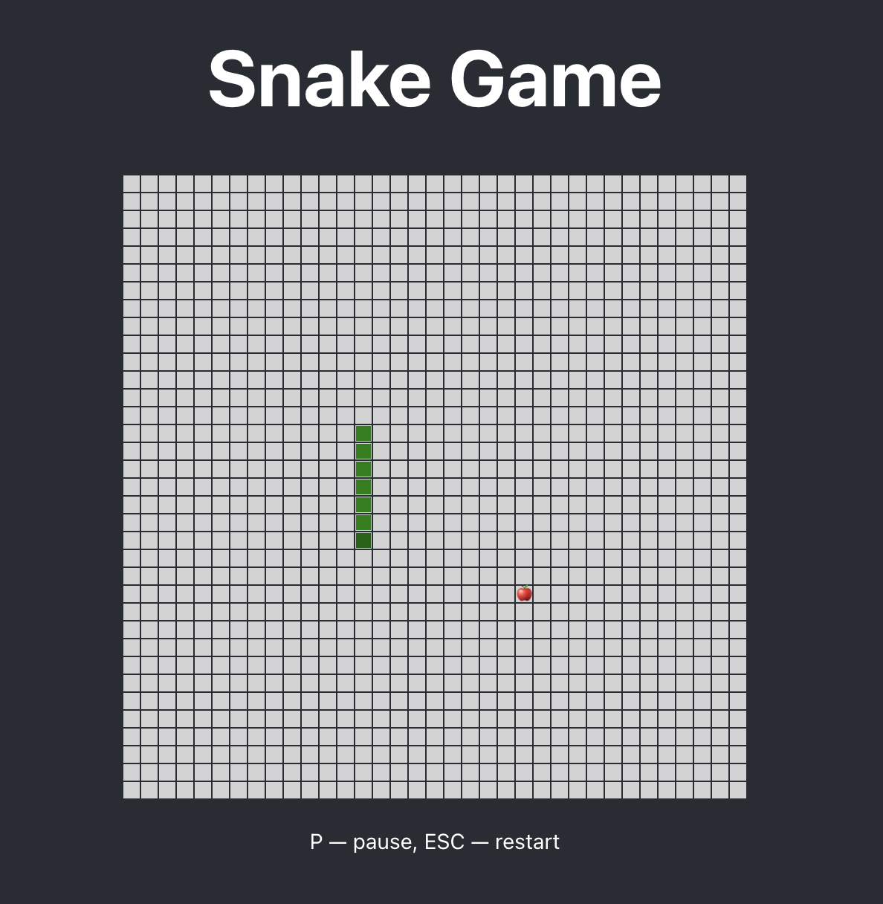

# React Snake Game

<center></center>

Welcome to the Snake Game! This is a simple implementation of the classic Snake game using JavaScript and React.

## Features

- Classic Snake gameplay
- Responsive design
- Score tracking (_not yet implemented_)

## Demo

[Live Demo](https://snake.newtryton.com)

## Installation

1. **Clone the repository:**

   ```sh
   git clone https://github.com/TinKurbatoff/snake-game.git
   cd snake-game
   ```

2. **Install and Run:**

   ```sh
   npm install
   npm start
   ```

3. **Building for production:**

   ```sh
   npm run build
   ```
